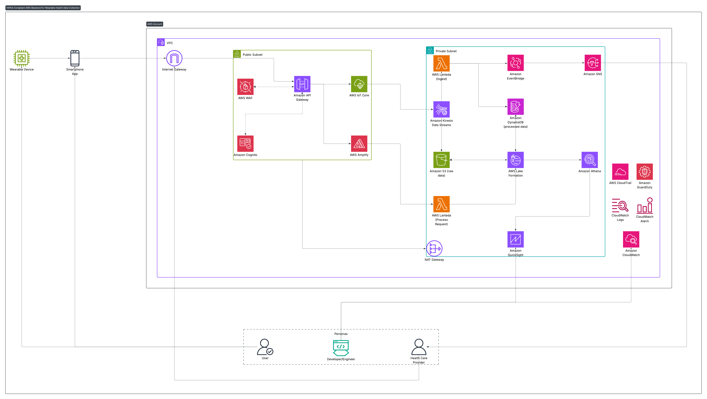

# Accessible Patient Monitoring Platform (HIPAA-Compliant)

## Overview

This application is a HIPAA-compliant cloud-native platform designed to help patients — especially visually impaired users — monitor their health data securely. While anyone can use the app, its design prioritizes accessibility, ensuring inclusivity for patients who may face barriers with traditional health applications.

The platform securely collects, stores, and processes patient health data, ensuring compliance with HIPAA security and privacy requirements.

## Architecture and Services

The solution leverages AWS services to ensure security, scalability, and compliance:

- Amazon S3 – Secure, encrypted storage for health records, files, and patient data.

- Amazon DynamoDB – Fast, serverless NoSQL database for storing patient profiles, device data, and session state.

- AWS Lambda – Serverless compute for event-driven data processing, ensuring minimal overhead and scalability.

- Amazon API Gateway – Securely exposes APIs for patient-facing and provider-facing applications.

- Amazon Cognito – Provides HIPAA-ready authentication and fine-grained access control for patients, caregivers, and providers.

- AWS KMS (Key Management Service) – Ensures encryption of all PHI (Protected Health Information) in transit and at rest.

- Amazon CloudWatch – Centralized monitoring, logging, and auditing of all platform activities.

- AWS VPC (with gateways and endpoints) – Network isolation and private connectivity for HIPAA compliance.

## Security & Compliance

- HIPAA Compliance – All services selected are HIPAA-eligible on AWS, with encryption, auditing, and strict access controls.

- Fine-Grained Access Control – Cognito roles and IAM policies enforce the principle of least privilege.

- Encryption – Patient data is encrypted in transit (TLS) and at rest (AES-256 via KMS).

- Audit Logging – All access and changes are logged through CloudWatch for HIPAA auditing and incident response.

## Accessibility Focus

Designed for visually impaired patients using screen readers, large-text modes, and voice-first interfaces.

Supports multiple patient groups but ensures that accessibility is not an afterthought — it is a core design principle.

## Use Cases

- Patients – Track and manage health data independently with accessible apps.

- Caregivers/Providers – Securely access patient data and assist in monitoring care.

- Researchers/Organizations – Deploy HIPAA-compliant patient monitoring systems at scale.
