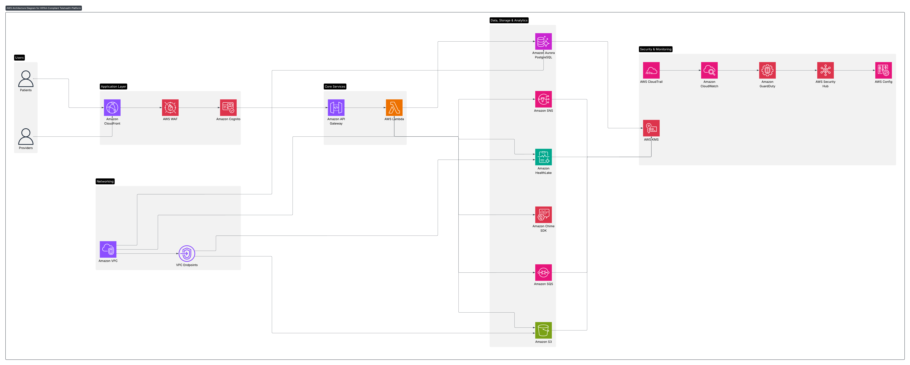

# 🏥 Telehealth Platform – AWS Well-Architected, HIPAA & FHIR-Compliant

## 📌 Overview

This repository presents a reference architecture for a HIPAA-ready telehealth system that enables:

- Patients to book appointments, view prescriptions, and attend secure telehealth sessions.
- Providers to manage schedules, record medical history & notes, and issue prescriptions.
- Secure storage of clinical data in FHIR format, ensuring interoperability and compliance with healthcare standards.

The solution is designed following the AWS Well-Architected Framework with the Healthcare Industry Lens, leveraging only HIPAA-eligible services.

## 🎯 Problem Statement

Telehealth systems must balance scalability, compliance, and usability. Common challenges include:

- Securely storing protected health information (PHI).
- Supporting FHIR APIs for interoperability.
- Ensuring HIPAA compliance (encryption, logging, monitoring).
- Handling scalable appointments, video consultations, and prescription workflows.

This project demonstrates how to solve these challenges using AWS services.

## 🏗️ Architecture

**High-Level Flow:**

1. Patients & providers log in through a secure web/mobile app.
2. **Cognito + WAF + CloudFront** handle authentication & edge security.
3. **API Gateway** routes requests to **Lambda** microservices.
4. **Aurora RDS** stores transactional data (appointments, prescription workflow).
5. **HealthLake** stores FHIR-compliant patient medical records, notes, and prescriptions.
6. **S3 (encrypted with KMS)** stores documents (labs, scans, PDFs) referenced in HealthLake.
7. **Chime SDK** enables HIPAA-ready telehealth video sessions.
8. **SNS/SQS** send reminders & event notifications.
9. **CloudTrail, CloudWatch, GuardDuty, Security Hub, Config** provide audit, monitoring, and compliance guardrails.

## 🧩 AWS Services Used
| Layer         | Service                           | Purpose                                            | HIPAA Eligible |
| ------------- | --------------------------------- | -------------------------------------------------- | -------------- |
| Edge Security | CloudFront + WAF                  | Protect apps from DDoS/OWASP threats               | ✅              |
| Identity      | Cognito                           | Patient & provider authentication (MFA, OIDC/SAML) | ✅              |
| API           | API Gateway                       | REST API layer for backend                         | ✅              |
| Compute       | Lambda                            | Serverless microservices                           | ✅              |
| Transactions  | Aurora PostgreSQL                 | Appointments & prescriptions metadata              | ✅              |
| Clinical Data | HealthLake                        | FHIR R4-compliant patient records & notes          | ✅              |
| Storage       | S3 + KMS                          | Documents, labs, scans                             | ✅              |
| Telehealth    | Chime SDK                         | Secure video visits                                | ✅              |
| Messaging     | SNS/SQS                           | Notifications & reminders                          | ✅              |
| Security      | IAM, KMS, GuardDuty, Security Hub | Encryption, least privilege, threat detection      | ✅              |
| Monitoring    | CloudTrail, CloudWatch, Config    | Audit logging & compliance                         | ✅              |

## 🔐 HIPAA & FHIR Compliance

- HIPAA: Only HIPAA-eligible services used. Requires a signed BAA with AWS.
- Encryption: All data encrypted in transit (TLS 1.2+) and at rest (KMS CMKs).
- Audit: CloudTrail + HealthLake versioning provide full audit trails.
- FHIR: HealthLake stores FHIR R4 resources (Patient, Encounter, MedicationRequest, DocumentReference, Observation, Provenance).

## 🚀 MVP vs. Full-Scale Deployment

- **MVP Phase**
  - Cognito auth
  - Appointment booking in Aurora
  - Basic FHIR writes to HealthLake (Patient, Encounter, MedicationRequest)
  - Chime session creation
  - Encrypted document storage in S3

- **Phase 2**
  - FHIR analytics & queries in HealthLake
  - EventBridge workflows (follow-ups, reminders)
  - Multi-tenant partitioning (cross-organization isolation)
  - QuickSight dashboards on de-identified data

## ⚠️ Disclaimers

- This repository is a reference design and does not itself process PHI.
- Deployment requires a signed AWS BAA and strict adherence to HIPAA shared responsibility model.
- IaC templates (CloudFormation/Terraform) will be added in later phases.
